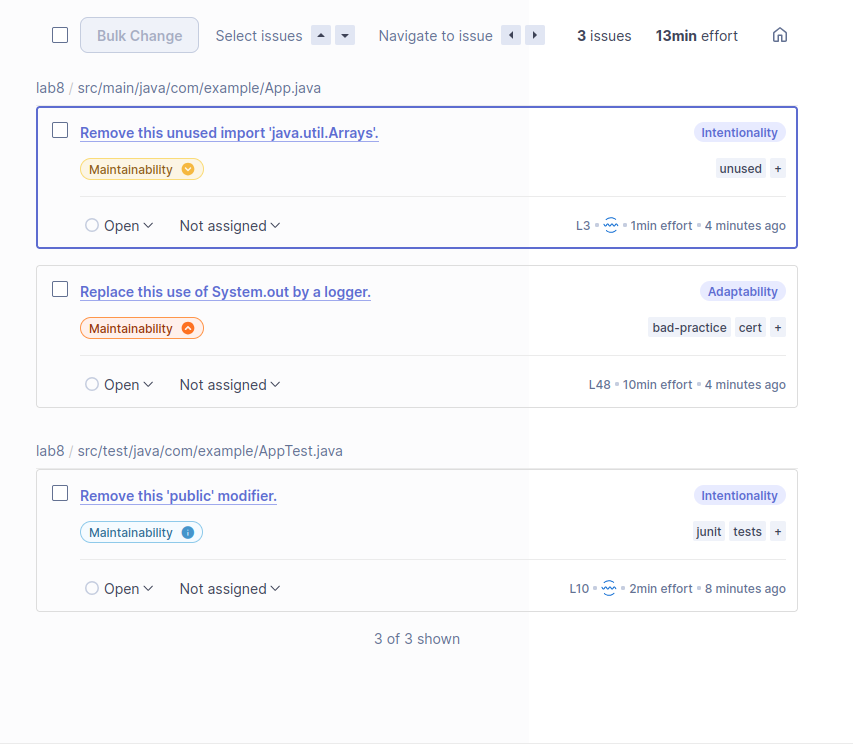

# G

Issue Type	Problem Description	How to Solve
Security	No security issues found in the current analysis.	—
Reliability	No reliability issues found in the current analysis.	—
Maintainability	Unused import java.util.Arrays.	Remove the unused import from App.java.
	Use of System.out.println() instead of a logger.	Replace with a proper logging framework (e.g., SLF4J, Log4j).
	Unnecessary public modifier in test class AppTest.	Remove the public modifier from the test class definition.
Security Hotspot	No security hotspots found in the current analysis.	—

# H
Checkstyle, PMD e SpotBugs são ferramentas de análise estática para Java que podem ser integradas ao SonarQube. O Checkstyle garante que o código segue regras de estilo e formatação. O PMD deteta más práticas e código morto. O SpotBugs analisa o bytecode para encontrar potenciais erros em tempo de execução. Juntas, ajudam a melhorar a qualidade, legibilidade e fiabilidade do código.
