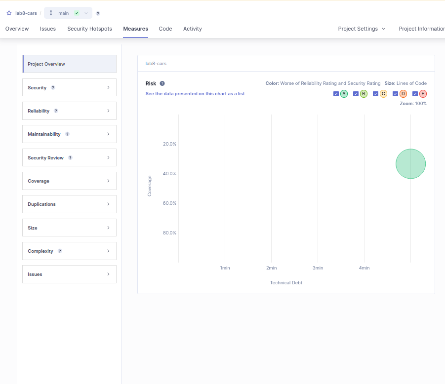
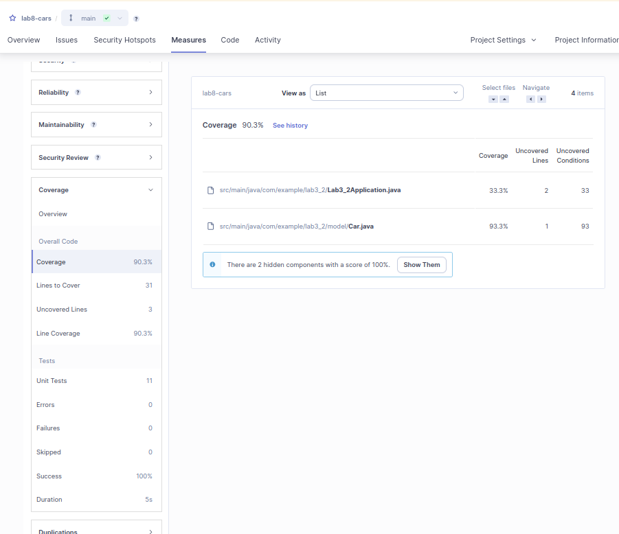
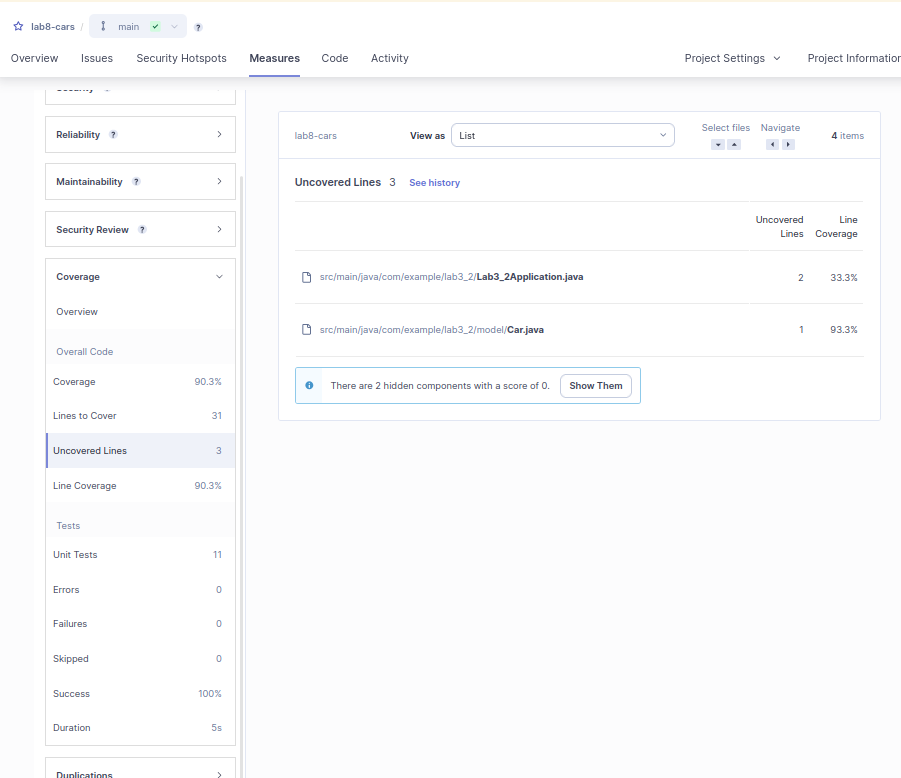

# C

Após a verificação do projeto lab8-cars no SonarQube, a Dívida Técnica identificada é de aproximadamente 4 minutos.
Esta métrica representa o tempo estimado necessário para corrigir pequenos problemas de manutenibilidade no código, como por exemplo imports não utilizados, uso de System.out.println() em vez de um logger, ou modificadores desnecessários.
Uma dívida técnica baixa (por exemplo, 4 minutos) indica que o código está, em geral, bem mantido e é fácil de refatorar, se necessário. A dívida é representada no gráfico de risco, que combina a cobertura de testes com a manutenibilidade para identificar áreas com potencial de melhoria.
 
# D

Como é evidente no painel do SonarQube, a cobertura de código do projeto lab8-cars é de 90,3%, o que representa um resultado muito bom.
O projeto possui um total de 31 linhas que devem ser cobertas por testes, das quais apenas 3 linhas não estão cobertas.
Especificamente, o ficheiro Lab3_2Application.java tem 2 linhas não cobertas (33,3% de cobertura), e o ficheiro Car.java tem 1 linha não coberta (93,3% de cobertura).
Além disso, existem 2 componentes ocultos com 0% de cobertura, que podem corresponder a ficheiros sem testes ou sem código executável.
Estes valores indicam uma boa base de testes, mas ainda há alguma margem para melhoria — especialmente na classe de aplicação. Aumentar a cobertura dessas linhas e ramos restantes proporcionará maior confiança nos testes e menor risco geral.